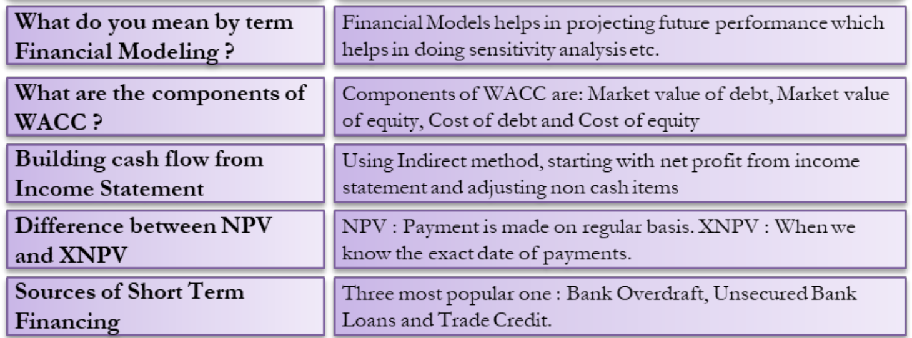
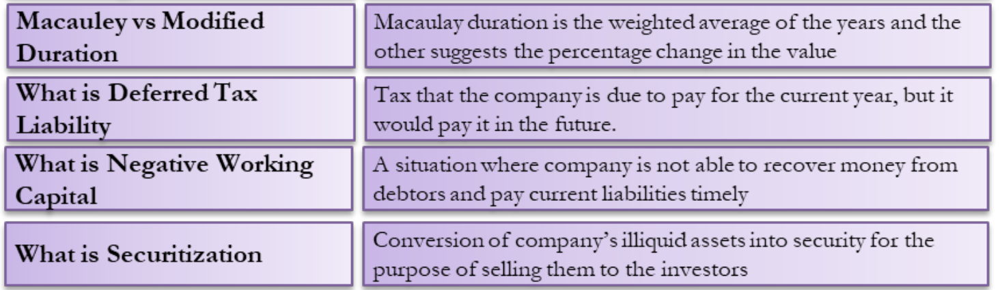
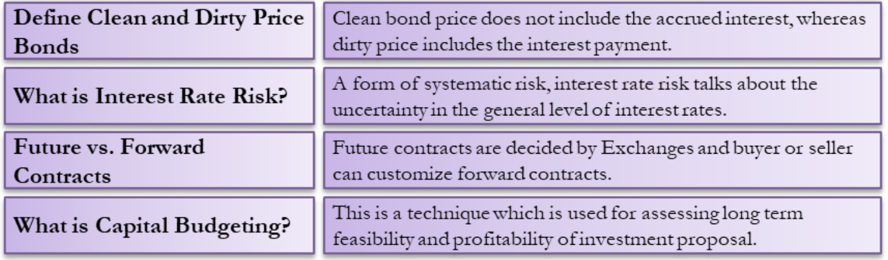

Warmup: Finance interview questions and Answers

- __Financial modeling__: the process of creating a summary of a company's expenses and earnings, in the form of a spreadsheet   
that can be used to calculate the impact of a future event or decision\
(Source: [investopedia](https://www.investopedia.com/terms/f/financialmodeling.asp))

- Weighted average cost of capital(__WACC__): a calculation of a firm's cost of capital in which each 
category of capital is proportinately weighted. 

WACC = (E * Re /V) + (D * Rd * (1-Tc)/V ), \
where
E=Market value of the firm's equity, \
D=Market value of the firm's debt, \
V=E+D, \
Re=cost of equity, \Rd=cost of debt, \
Tc=corporate tax rate. \
Weighted value of equity-linked capital=(E/V) * Re, \
weighted value of debt-linked capital=(D/V) * Rd * (1-Tc). \

WACC inc <-> beta (volatility of a stock, i.e. both risk and return) and rate of retuen on equity inc
<-> valuation dec and risk inc (remember WACC is a 'cost')\
(Source: [invstopedia](https://www.investopedia.com/terms/w/wacc.asp))

- 'Build a cash flow (statement)' from an income statement:
- __Income statement__ (profit and loss statement / statement of revenue and expense): one of the three important financial statements, used for reporting a company's financial performace   over a 
specific accounting period. \
  The other two key statements are the __balance sheet__, and the __statement of cash flows__. 
  - four key items:
    - revenue
      - operating revenue: the revenue realised via primary activities (e.g. sale of product for a wholesaler)
      - non-operting revenue: the revenue realised via secondary, non-core business activities (e.g. interest income earned on business capital lying in the bank)
    - gains (aka other income): net income from sale of long-term assets), incl. net money made from one-time non-business activities, e.g. unused land, a subsidiary company
      - Note: tell revenue from receipt (cash accounted for when money is actually received)
    - expenses
      - primary activity expenses: incl. cost of goods sold (COGS), selling, and general administrative expenses (SG&A), depreciation or amortisation (the systematic repayment of a debt), research and development (R&D) expenses, emplyee wages
      - secondary activity expenses: all expenses linked to non-core business activities, e.g. interests paid on loan money
    - losses (as expenses): all expenses that go to a loss-making sale of long-term assets, one-time or any other un-usual costs, or expenses towards lawsuits 
      - e.g.++++++++++++++\
(Source: [investopedia-Income statement](https://www.investopedia.com/terms/i/incomestatement.asp))
-  __Statement of cash flows__: provides aggregate data regarding all cash inflows that a company reveices from its ongoing operations and 
-  external investment sources. \
(Source: [Cash flow statement](https://www.investopedia.com/investing/what-is-a-cash-flow-statement/); 
[Understanding a cash flow statement](https://www.investopedia.com/investing/what-is-a-cash-flow-statement/))

